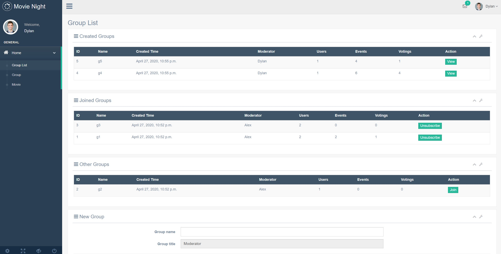
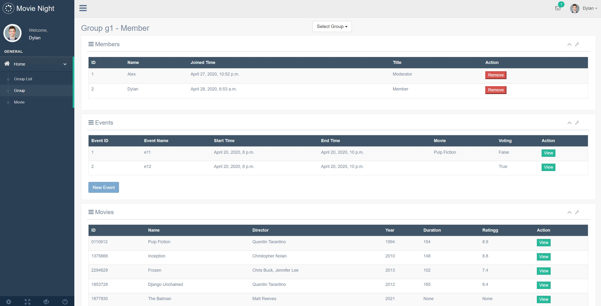
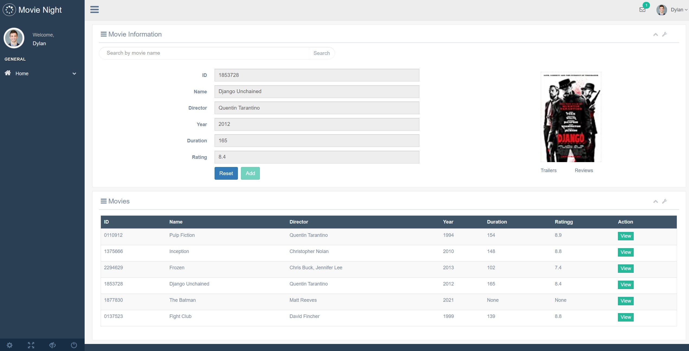

# Movie Night
Movie Night is a  web application for people who want to have movie events with friends. It is achieved based on [django-gentelella](https://github.com/GiriB/django-gentelella).

##  Model Design
+   [Presentation](https://docs.google.com/presentation/d/1eq3Xs65vIReFw71heYDj6pfRO0N9VgQ_58r1UGmSSkY/edit?usp=sharing) 

+   [Use Cases Design](use_cases.md)

## Install requirements 
```python
pip install -r requirements.txt
```

## Run locally
```python
cd movie_night
python manage.py migrate
python manage.py runserver
```

## Screenshots




##  License
[WTFPL](http://www.wtfpl.net/txt/copying/)