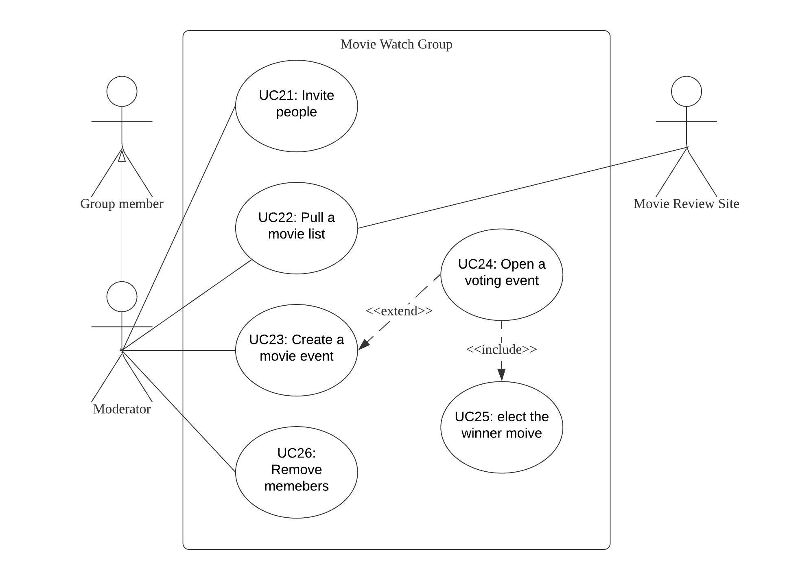

#   Movie Watching Group
>  [Presentation Here](https://docs.google.com/presentation/d/1eq3Xs65vIReFw71heYDj6pfRO0N9VgQ_58r1UGmSSkY/edit?usp=sharing) 

##  Contents
-   [Actors](#Actors)
    -   [User](#User)
    -   [Group Member](#Group-Member)
    -   [Moderator](#Moderator)
    -   [Movie Review Site](#Movie-Review-Site)
-   [Use Case Diagrams](#Use-Case-Diagrams)
-   [Class Diagram](#Class-Diagram)
-   [Class Packages](#Class-Packages)
-   [State Diagram](#State-Diagram)
-   [Traceability Matrix](#Traceability-Matrix)
-   [Use Cases with Sequen Diagrams](#Use-Cases)
    -   User Related
        -   [UC01.   Login](#UC01)
        -   [UC02.   Create a Group ](#UC02)
        -   [UC03.   Join a Group](#UC03)
    -   Group Member Related
        -   [UC11.   Unsubscribe a Group](#UC11)     
        -   [UC12.   Search Movies](#UC12)          
        -   [UC13.   Watch Trailers](#UC13)  
        -   [UC14.   Watch Reviews](#UC14)
        -   [UC15.   Vote](#UC15)
    - Moderator Related
        -   [UC21.   Invite People](#UC21)
        -   [UC22.   Pull a Movie List](#UC22)
        -   [UC23.   Create a Movie Event](#UC23)    
        -   [UC24.   Open a Voting Event](#UC24)  
        -   [UC25.   Elect Winner](#UC25)
        -   [UC26.   Remove Members](#UC26)

##  Actors 
### User
+   Basic actor.
+   Has access to create or join a group.
### Group Member
+   Inherited from user who joined or created a group.
+   Has access to engage the group events.
###  Moderator 
+   Inherited from Group member who created the group.    
+   Has access to manage the group, such as invite people or remove members.
###  Movie Review Site 
+   A external website provides movie information, including reviews and trailers. 

##  Use Case Diagrams 
+   User   

+   Group Member   

+   Moderator   

##  Class Diagram

##  Class Packages 

##  Traceability Matrix 

|   Index   |       Features    |
|-----------|-------------------|
|   F01     |   The system shall allow a group moderator to create a movie watcher’s group.  |
|   F02     |   The system shall allow the moderator to invite family and friends to join the group. |
|   F03     |   The system shall allow friends and family to join a group of movie watchers. |
|   F04     |   The system shall allow people to unsubscribe from movie watcher’s groups.    |
|   F05     |   The system shall allow the moderator to populate movie watcher’s groups with a list of potential movies that could be watched.   |
|   F06     |   The system shall allow the moderator to pull a movie list from a movie list server/API.  |
|   F07     |   The system shall allow group members to search and browse the movies that have been populated by the moderator. |
|   F08     |   The system shall allow group member to watch the trailer of the movies that have been populated by the moderator.    |
|   F09     |   The system shall allow group members to have access to movie reviews of the movies that have been populated by the moderator.    |
|   F10     |   The system shall allow the moderator to create a movie watching event that will occur in the specified date and time defined by the moderator.   |
|   F11     |   The system shall allow the moderator to open and close a voting period for a specific movie watching event.  |
|   F12     |   The system shall allow participants of a movie watcher group to be notified that a movie watching event was created and that they can vote for a movie for watching.    |
|   F13     |   The system shall allow group participants to cast their votes in a specific movie watching event previously created by the moderator. |
|   F14     |   The system shall keep the history of movie watching events, votes, and winners for each movie watching group.    |    
|   F15     |   The system shall elect a single movie winner for a movie watching event based on the votes casted by the movie watcher group.   |
|   F16     |   The system shall not allow participants of a movie watching group to change their votes AFTER the system computed the winner movie based on casted votes.   |

##  State Diagram   

##  Use Cases
+   UC01.   Login  
    | Specs             |           |
    | ----------------- | --------- |
    |   ID              |   UC01    |
    |   Name            |   Login   |
    |   Description     |   Every user has to login before using this application.    |
    |   Pre Conditon    |   The user has not logged in.             |
    |   Post Conditon   |   The user has access to its information.    |
    |   Steps           |   User inputs username/email and password.      |
    |                   |   User clicks login button.                     |
    |                   |   The system compares login information with database.    |
    |                   |   If the information matches, allows the user to login, otherwise displays login error.   |
    
    

+   UC02.   Create a Group  
    | Specs             |           |
    | ----------------- | --------- |
    |   ID              |   UC02    |
    |   Name            |   Create a group     |
    |   Description     |   User creates a group and becomes the moderator of the group.    |
    |   Pre Conditon    |   The use has logged in. |
    |   Post Conditon   |   The user becomes the moderator of the group.  |
    |   Steps           |   User creates a group and names the group.     |
    |                   |   The system creates the group into database.   |
    |                   |   The system displays create successful information.|

    

+   UC03.   Join a Group 
    | Specs                  |           |
    | ----------------- | --------- |
    |   ID              |   UC03    |
    |   Name            |   Join a Group |
    |   Description     |   User joins a group and becomes the member of the group.    |
    |   Pre Conditon    |   The use has logged in. |
    |                   |   There is at least one group.    |
    |   Post Conditon   |   The user becomes the member of the group.  |
    |   Steps           |   User selects a group from the group list and joins the group.     |
    
    

+   UC11.   Unsubscribe a Group 
    | Specs                  |           |
    | ----------------- | --------- |
    |   ID              |   UC11    |
    |   Name            |   Unsubscribe a Group |
    |   Description     |   Group member unsubscribes a group.  |
    |   Pre Conditon    |   The user is a member in the group.|
    |   Post Conditon   |   The system remove the user from group list.  |
    |   Steps           |   User unsubscribes the group.    |
    |                   |   The system remove the user from group list. |

    

+   UC12.   Search Movies 
    | Specs             |           |
    | ----------------- | --------- |
    |   ID              |   UC12    |
    |   Name            |   Search movies   |
    |   Description     |   Group member searches movies in the group.   |
    |   Pre Conditon    |   The user is the member of the group.    |
    |   Post Conditon   |   The system shows the searched movie information.    |
    |   Steps           |   Group member types a movie name.      |
    |                   |   If the group has the movie, the system displays the movie information.  |
    |                   |   Otherwise, the system displays movie not exists.    |

    
    

+   UC13.   Watch Trailers 
    | Specs             |           |
    | ----------------- | --------- |
    |   ID              |   UC13    |
    |   Name            |   Watch Trailers   |
    |   Description     |   Group member watches movie trailers.   |
    |   Pre Conditon    |   The user is the member of the group.    |
    |                   |   The movie is in the movie list.         |
    |   Post Conditon   |   None.    |
    |   Steps           |   Group member watches movie trailers.     |

    

+   UC14.   Watch Reviews 
    | Specs             |           |
    | ----------------- | --------- |
    |   ID              |   UC14    |
    |   Name            |   Watch Reviews   |
    |   Description     |   Group member watches movie Reviews.   |
    |   Pre Conditon    |   The user is the member of the group.    |
    |                   |   The movie is in the movie list.         |
    |   Post Conditon   |   None.    |
    |   Steps           |   Group member watches movie Reviews.     |

    

+   UC15.   Vote 
    | Specs             |           |
    | ----------------- | --------- |
    |   ID              |   UC15    |
    |   Name            |   Vote    |
    |   Description     |   Group member votes for a movie in a voting event.   |
    |   Pre Conditon    |   The moderator has opened a voting event.    |
    |                   |   The voting event is not closed.         |
    |   Post Conditon   |   The system add a vote for the voted movie.    |
    |   Steps           |   The user votes for a movie.     |
    |                   |   The system add a vote for the voted movie.     |

    

+   UC21.   Invite People 
    | Specs             |           |
    | ----------------- | --------- |
    |   ID              |   UC21    |
    |   Name            |   Invite People   |
    |   Description     |   Moderator invites people into the group.   |
    |   Pre Conditon    |   The user is the moderator of the group.    |
    |                   |   The invited user is not in the group.       |
    |   Post Conditon   |   The system add the invited user to group.    |
    |   Steps           |   Moderator invites people into the group.     |
    |                   |   The system adds the user to the group.  |     

    
         
+   UC22.   Pull a Movie List 
    | Specs             |           |
    | ----------------- | --------- |
    |   ID              |   UC22    |
    |   Name            |   Pull a Movie List   |
    |   Description     |   The moderator pulls a movie list from an external website.   |
    |   Pre Conditon    |   The user is the moderator of the group.    |
    |   Post Conditon   |   The system adds the pulled list into the movie list.    |
    |   Steps           |   The moderator pulls a movie list from an external website.     |
    |                   |   The system adds the pulled list into the movie list.  | 

      

+   UC23.   Create a Movie Event    
    | Specs             |           |
    | ----------------- | --------- |
    |   ID              |   UC23    |
    |   Name            |   Create a Movie Event   |
    |   Description     |   Moderator creates a movie event for the group.   |
    |   Pre Conditon    |   The user is the moderator of the group.    |         
    |   Post Conditon   |   The system add the movie event into the event history.    |
    |   Steps           |   Moderator creates a movie event for the group.     |
    |                   |   Moderator sets the time and movie for the event.   |
    |                   |   The system add the movie event into the event history.  |
    |   Extend          |   UC24: Open a Voting Event   |

    

+   UC24.   Open a voting event 
    | Specs             |           |
    | ----------------- | --------- |
    |   ID              |   UC24    |
    |   Name            |   Open a Voting Event   |
    |   Description     |   Moderator opens a voting event for a movie event.   |
    |   Pre Conditon    |   The user is the moderator of the group.    |         
    |   Post Conditon   |   The system closes the voting event by the closing time.    |
    |   Steps           |   Moderator opens a voting event for a movie event.           |
    |                   |   Moderator sets start and close time for the voting event.    |
    |                   |   The system adds the voting event into the event history.     |
    |   Include         |   UC25: Elect winner |

    

+   UC25.   Elect winner
    | Specs             |           |
    | ----------------- | --------- |
    |   ID              |   UC25    |
    |   Name            |   Elect Winner   |
    |   Description     |   The system count the most voted movie.   |
    |   Pre Conditon    |   The voting event is closed.    |
    |   Post Conditon   |   The system inform the result to group members.    |
    |   Steps           |   The system counts the most voted movie.     |
    |                   |   The system records the winner.          |
    |                   |   The system informs the group member.     |

    

+   UC26.   Remove Members
    | Specs             |           |
    | ----------------- | --------- |
    |   ID              |   UC26    |
    |   Name            |   Remove Members   |
    |   Description     |   The moderator removes a member from the group.   |
    |   Pre Conditon    |   The user is the moderator of the group.    |
    |                   |   The group has least one members.
    |   Post Conditon   |   The system removes the member from the group list.    |
    |   Steps           |   The moderator removes a member from the group.     |
    |                   |   The system removes the member from the group list.     |

    
